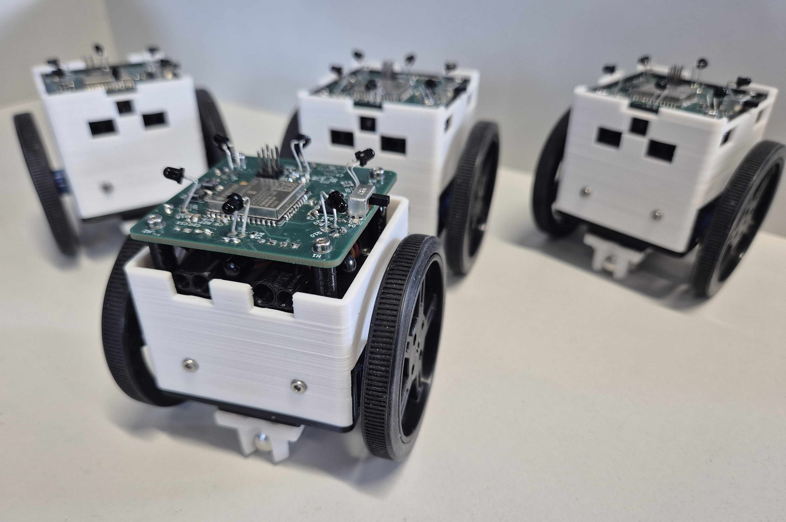
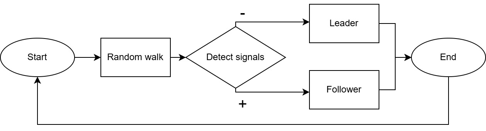
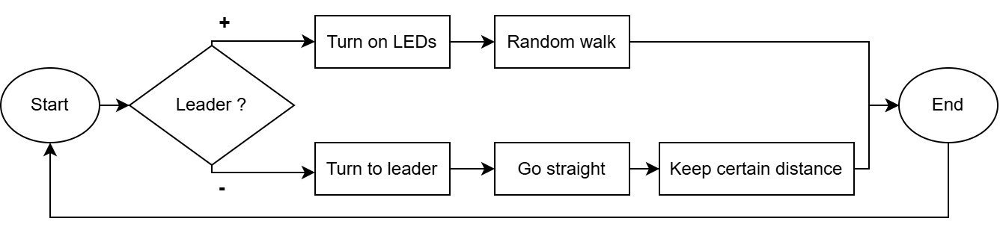
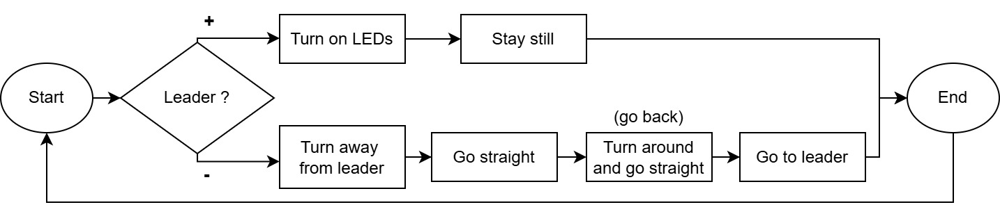
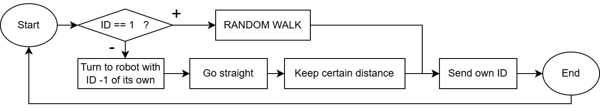
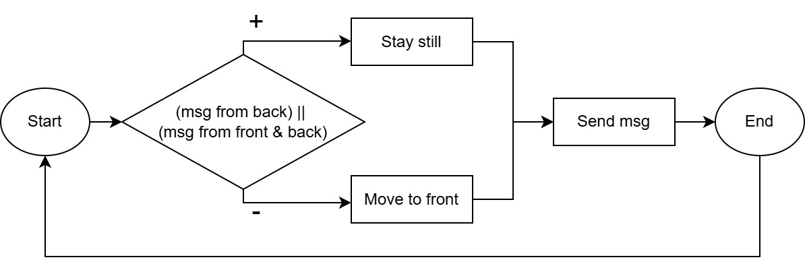
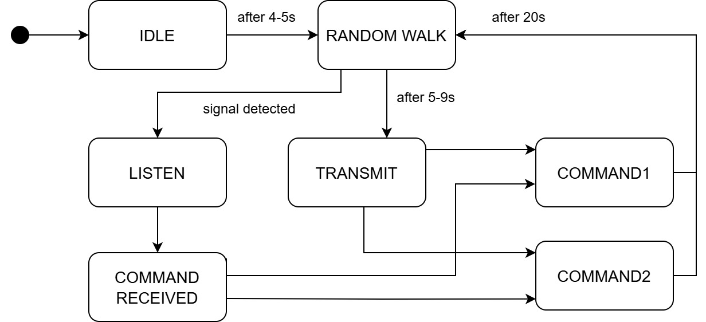

# Swarm Robot Platform

A low-cost, scalable swarm robotic platform designed for research and educational purposes, capable of infrared (IR)-based communication and basic cooperative behaviors.

Playlist of videos showcasing robots and algorithms: https://www.youtube.com/playlist?list=PLNTM9zCJujTltedypfpow2rPiPkVAqfGI

---

## 🧠 About the Project

This project focuses on the design of a **cooperative robotic platform** built around the ESP32 microcontroller. The primary goal is to enable simple, local communication and decentralized coordination among identical robots, forming a **swarm**.

**Key design constraints:**
- Minimal production cost (~24 EUR/robot, parts only)
- Compact and robust mechanical design
- Infrared-based full-duplex communication (360°)
- Modular and scalable C firmware using ESP-IDF
- Developed as part of a Bachelor’s Thesis at Brno University of Technology

> **Thesis Title:**  
> *Návrh a realizace kooperativní robotické platformy s jednoduchou komunikací*  
> (*Design and Implementation of a Cooperative Robotic Platform with Simple Communication*)

---

## ⚙️ Features

### 🔁 360° IR Communication
6 pairs of IR LEDs and phototransistors evenly placed around the robot enable full directional communication.

### 🚧 Obstacle Detection
2 front-facing IR LED + phototransistor pairs detect obstacles.

### 🤖 Cooperative Algorithms

#### With Leader
- Simulates a robot "calling" others to complete a task.
- Modified CSMA/CA protocol ensures robots check for ongoing transmissions before broadcasting.
- Robots walk randomly looking for signals:
  - If signal is found in a randomly chosen time window → the robot becomes a **follower**.
  - If not → the robot becomes a **leader**.
- **Leader** can be pre-set (WITH_LEADER 1)

- **Flowchart of system with leader:**

- **Implemented algorithms:**

  - **Follow**  
    Followers track the leader, who moves randomly.  
    
  
  - **Spread Out**  
    Leader stays in place and acts as a beacon. Followers spread and return.  
    

#### Without Leader
- No signal detection or leader election.
- Algorithms run immediately after power-on.
  
- **Implemented algorithms:**

  - **Follow Chain**  
    Robots follow each other in a line. First robot walks randomly. Predefined or dynamic ID (order) assignment.  
    
  
  - **Chain**  
    Robots stay still in a line. The last robot moves forward to the front.  
    

### 🧠 FSM-Controlled Behavior

Each robot uses a finite state machine (FSM) for autonomous control and decision-making. The diagram shows the flow of states of algorithms with leader.  

### 🔧 Firmware Modules

- `io_define` – I/O pin mappings, robot ID
- `servo_driver` – movement (servo) control
- `led_driver` – IR LED driver
- `hwtimer` – Hardware timer driver
- `adc_lib` – ADC driver
- `dm_comm` – IR communication (Manchester encoding, CSMA/CA)
- `coop` – Cooperative algorithm logic
- `state_machine` – FSM and behavior transitions

---

## 🛠️ Setting Up

### Requirements

- [ESP-IDF](https://docs.espressif.com/projects/esp-idf/en/latest/esp32/)
- PlatformIO (recommended; VS Code plugin)  
  Target board: `ESP32DOIT-DEVKIT-V1`
- USB-to-UART bridge (e.g. CP2102)

### 🔧 Calibration  

- **Movement Calibration**  
  The robot doesn’t use encoders, so the motors may spin at different speeds, causing drift.  
  Adjust `SERVO_FORWARD_LEFT_MOD` and `SERVO_BACKWARDS_RIGHT_MOD` in `io_define.h` to straighten movement.

- **IR Signal Thresholds**  
  Tune `SIG_THRESHOLD` in `dm_comm.h` and `DIS_THRESHOLD` in `coop.h` to adjust signal sensitivity.

- **Algorithm Selection**  
  Some algorithms (like **Chain** or **Follow Chain**) should start immediately on power-up.  
  Define the startup behavior by setting flags to "1" (`CHAIN` or `FOLLOW_CHAIN`).

### ⚡ Flashing Instructions  

1. Connect the robot to your computer via USB.
2. Open `io_define.h` and set:
   - `ROBOT_ID` – unique number per robot
   - `WITH_LEADER` – `1` (for pre-set leader - ID1) or `0`
   - `CHAIN` or `FOLLOW_CHAIN` – chosen algorithm
3. Build and flash the firmware
